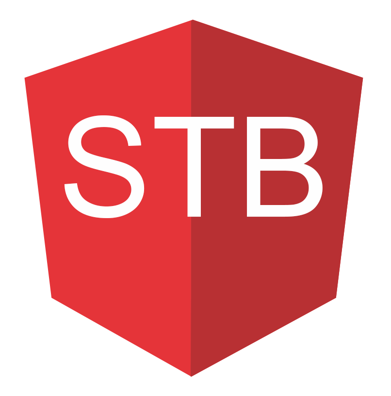

# CRM 系统快速开发框架

  

基于最新`Angular 7`框架与`Material2`技术的企业级 CRM 系统快速开发框架，涵盖了大量的常用组件和基础功能，最大程度上帮助企业节省时间成本和费用开支。

### Plaform

### Feature

- 基于 Material Design 精心设计
- 多种颜色方案，有多个预定义的配色方案
- Flex Layout 强大的布局，并支持响应式设计
- 组件丰富，提炼后台应用的典型页面和场景
- 模块代码，添加和删除非常轻松
- 渐进式应用(PWA)，更接近原生应用体验
- 支持 docker 构建镜像， 急速部署，轻松使用
- 支持 electron 构建桌面应用
- 接入 firebase， 构建应用提供良好的用户体验
- 不定期更新，使用前端前沿技术开发新功能

### 关联项目

中后台前端应用框架: [https://github.com/stbui/angular-material-app](https://github.com/stbui/angular-material-app)